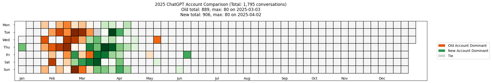

# 🧠 ChatGPT Usage Heatmap (OpenAI Old vs New Account)

This project visualizes your usage of ChatGPT over time, using heatmaps inspired by GitHub contribution graphs. It compares your **current (new)** ChatGPT account activity with a previously exported **old** account, helping you analyze engagement patterns across the year.

---

## 📊 Visualization Features

### 1. 🔥 Calendar Heatmap (Single Account)
Generates a year-view heatmap showing number of conversations per day.

- Days with more interactions are shaded darker.
- Most active day is highlighted in the title.

### 2. ⚔️ Comparison Heatmap (Old vs New)
Displays a colored overlay comparing two accounts:
- 🟧 **Orange**: Old account was more active
- 🟩 **Green**: New account was more active
- ⬜ **Gray**: Equal usage (or zero on both)

---

## 🛠 How It Works
1.	Data Extraction: The exported JSON from your ChatGPT account (Settings → Data Controls → Export) contains all conversations.
2.	Flattening Conversations: Python scripts extract timestamps from each message node (user or assistant) and convert them to datetime objects.
3. Heatmap Construction: Using matplotlib, messages are aggregated by date and visualized on a weekly calendar grid.

---

### 🖼️ Output: Account Comparison Heatmap

This heatmap compares usage between your old and new ChatGPT accounts in 2025:

